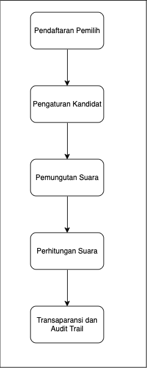

# Bab 7 : Smart Contract dan Implementasi dalam Sistem Pemilu

Dalam era digital yang terus berkembang, teknologi blockchain telah muncul sebagai solusi inovatif untuk meningkatkan kepercayaan dan transparansi dalam berbagai bidang, termasuk pemilihan umum. Pemilu yang adil dan transparan adalah salah satu pilar utama dalam sistem demokrasi. Namun, tantangan seperti kecurangan pemilih, manipulasi suara, dan kurangnya transparansi sering kali mengancam integritas pemilu. Smart contract, yang merupakan salah satu fitur utama dari teknologi blockchain, menawarkan pendekatan baru dalam menangani masalah ini. Bab ini akan memberikan pemahaman dasar tentang smart contract, bagaimana mereka berfungsi, dan peran pentingnya dalam sistem pemilu.

## 7.1. Definisi Smart Contract
Smart contract adalah program komputer yang disimpan dan dijalankan di dalam jaringan blockchain. Smart contract berfungsi sebagai perjanjian otomatis yang dapat mengeksekusi, mengontrol, atau mendokumentasikan peristiwa dan tindakan ketika syarat tertentu terpenuhi. Dalam konteks blockchain, smart contract memungkinkan transaksi dan interaksi antara pihak-pihak yang tidak saling percaya tanpa memerlukan perantara.

Karakteristik Utama Smart Contract:
- Otomatisasi: Smart contract dieksekusi secara otomatis ketika kondisi yang telah ditentukan sebelumnya terpenuhi.
- Transparansi: Semua pihak dapat mengakses dan memverifikasi kode dan hasil dari smart contract, sehingga mengurangi kemungkinan kecurangan.
- Keamanan: Menggunakan teknologi kriptografi untuk menjaga integritas dan keamanan data.
- Desentralisasi: Smart contract dijalankan di dalam jaringan terdistribusi, sehingga mengurangi risiko sentralisasi dan kontrol oleh satu entitas.

## 7.2. Fungsi Smart Contract dalam Sistem Pemilu
Smart contract memiliki beberapa fungsi penting dalam konteks pemilu, antara lain:

1. Pengaturan Aturan Pemungutan Suara
Smart contract dapat mendefinisikan aturan pemungutan suara secara jelas dan transparan. Misalnya, smart contract dapat menentukan kriteria pemilih yang berhak memberikan suara, kandidat yang dapat dipilih, dan batasan waktu untuk memberikan suara.

2. Validasi Pemilih
Dengan menggunakan smart contract, sistem dapat memverifikasi apakah seorang pemilih telah memenuhi syarat untuk memberikan suara. Hal ini membantu mencegah penipuan pemilih dan memastikan bahwa hanya pemilih yang valid yang dapat berpartisipasi.

3. Pencatatan Suara
Setiap suara yang diberikan akan dicatat dalam blockchain melalui smart contract. Ini memastikan bahwa data pemungutan suara tidak dapat diubah atau dimanipulasi, sehingga meningkatkan integritas hasil pemilu.

4. Penghitungan Suara
Smart contract dapat secara otomatis menghitung jumlah suara yang diterima oleh setiap kandidat. Ini mengurangi kebutuhan untuk menghitung suara secara manual, yang dapat rentan terhadap kesalahan manusia atau manipulasi.

5. Transparansi Hasil Pemilu
Dengan semua data pemungutan suara yang tercatat dalam blockchain, hasil pemilu dapat diakses dan diverifikasi oleh semua pihak yang berkepentingan, termasuk pemilih, kandidat, dan lembaga pengawas pemilu. Ini menciptakan tingkat transparansi yang tinggi dan kepercayaan dalam proses pemilu.

## 7.3. Arsitektur dan Desain Smart Contract untuk Pemilu
Arsitektur dan desain smart contract merupakan aspek penting dalam memastikan bahwa sistem pemilu berbasis blockchain berfungsi dengan baik, aman, dan transparan. Dalam konteks pemilu, smart contract harus dirancang untuk memenuhi kebutuhan spesifik, termasuk pendaftaran pemilih, pencatatan suara, dan penghitungan hasil secara otomatis. Berikut adalah komponen utama yang harus dipertimbangkan dalam arsitektur dan desain smart contract untuk pemilu.

### 7.3.1. Komponen Utama Smart Contract Pemilu

1. Pendaftaran Pemilih
   - Fungsi Pendaftaran: Smart contract harus memiliki fungsi untuk mendaftarkan pemilih yang memenuhi syarat. Ini termasuk verifikasi identitas pemilih dan menyimpan informasi yang diperlukan, seperti nama, ID pemilih, dan status validasi.
   - Validasi: Mekanisme untuk memvalidasi bahwa pemilih belum terdaftar sebelumnya dan memenuhi kriteria yang ditentukan.

2. Pengaturan Kandidat
   - Daftar Kandidat: Smart contract harus memungkinkan penambahan dan pengelolaan daftar kandidat yang dapat dipilih oleh pemilih. Setiap kandidat harus memiliki ID unik dan informasi relevan lainnya.
   - Fungsi Validasi Kandidat: Fungsi untuk memverifikasi bahwa kandidat yang dipilih oleh pemilih adalah kandidat yang valid.

3. Pemungutan Suara
   - Fungsi Pemberian Suara: Implementasi fungsi yang memungkinkan pemilih untuk memberikan suara mereka. Setelah suara diberikan, sistem harus memastikan bahwa suara tersebut tercatat dengan benar dan tidak dapat diubah.
   - Pencegahan Kecurangan: Logika untuk memastikan bahwa setiap pemilih hanya dapat memberikan suara sekali, serta mekanisme untuk mencegah manipulasi suara.

4. Penghitungan Suara
   - Fungsi Penghitungan: Smart contract harus dapat menghitung jumlah suara yang diterima oleh setiap kandidat secara otomatis. Hasil penghitungan harus disimpan di blockchain untuk menjamin transparansi dan keandalan.
   - Fungsi Pelaporan: Kemampuan untuk memberikan hasil pemilu kepada pihak terkait, seperti pemilih, kandidat, dan lembaga pengawas.

5. Transparansi dan Audit
   - Penyimpanan Data: Semua transaksi dan hasil pemilu harus disimpan dalam blockchain sehingga dapat diakses dan diverifikasi oleh semua pihak yang berkepentingan.
   - Audit Trail: Menciptakan jejak audit yang memungkinkan pihak ketiga untuk memverifikasi keaslian dan integritas hasil pemilu.

### 7.3.2. Alur Proses Pemungutan Suara
Untuk memberikan gambaran yang lebih jelas tentang bagaimana smart contract akan diimplementasikan dalam sistem pemilu, berikut adalah alur proses pemungutan suara yang umum:

1. Pendaftaran Pemilih: Pemilih yang memenuhi syarat melakukan pendaftaran melalui antarmuka pengguna yang terhubung dengan smart contract. Informasi pemilih disimpan di blockchain.
2. Pengumuman Kandidat: Kandidat yang akan berpartisipasi dalam pemilu diumumkan dan ditambahkan ke dalam smart contract.
3. Pemungutan Suara: Saat pemilu berlangsung, pemilih dapat memberikan suara mereka melalui antarmuka. Smart contract akan mencatat setiap suara yang diterima untuk kandidat yang dipilih.
4. Penghitungan Suara: Setelah pemungutan suara ditutup, smart contract akan secara otomatis menghitung jumlah suara untuk setiap kandidat dan menyimpan hasilnya di blockchain.
5. Pelaporan Hasil: Hasil pemilu dapat diakses oleh semua pihak melalui antarmuka yang menampilkan informasi yang jelas dan transparan tentang hasil pemungutan suara.

### 7.3.3. Diagram Arsitektur Smart Contract
Untuk lebih memperjelas, berikut adalah diagram arsitektur yang menggambarkan hubungan antara komponen-komponen utama dalam smart contract pemilu:



Dengan desain yang hati-hati dan arsitektur yang jelas, smart contract untuk sistem pemilu dapat meningkatkan kepercayaan publik, mencegah kecurangan, dan memastikan hasil pemilu yang adil dan transparan. Desain ini juga akan mendukung penerapan teknologi blockchain secara efektif dalam proses pemilihan umum, menjadikannya solusi yang layak untuk tantangan yang dihadapi dalam pemilu tradisional.

## 7.4. Implementasi Smart Contract dalam Sistem Pemilu
Implementasi smart contract dalam sistem pemilu bertujuan untuk meningkatkan transparansi dan integritas proses pemungutan suara. Dalam proyek ini, kami akan fokus pada beberapa fitur kunci yang telah dibahas sebelumnya, menggunakan bahasa pemrograman Go. Berikut adalah penjelasan rinci tentang fitur-fitur yang diimplementasikan dan potongan kode terkait.

### 7.4.1. Fitur yang Diimplementasikan
**Pendaftaran Pemilih**
Fitur ini memungkinkan pemilih yang memenuhi syarat untuk mendaftar dalam sistem. Data pemilih disimpan di dalam smart contract, memastikan bahwa hanya pemilih yang terdaftar yang dapat memberikan suara. Kode di bawah ini menunjukkan bagaimana pendaftaran pemilih dilakukan:

```go
type Election struct {
	Candidates []string
	Votes      map[string]int
	Voters     map[string]bool
}

func NewElection(candidates []string) *Election {
	return &Election{
		Candidates: candidates,
		Votes:      make(map[string]int),
		Voters:     make(map[string]bool),
	}
}
```

**Pengaturan Kandidat**
Dalam sistem ini, kandidat yang berpartisipasi dalam pemilu dapat ditambahkan ke dalam daftar. Berikut adalah cara kita mengatur kandidat dalam smart contract:

```go
func (e *Election) AddCandidate(candidate string) error {
	if e.isValidCandidate(candidate) {
		return fmt.Errorf("candidate %s already exists", candidate)
	}
	e.Candidates = append(e.Candidates, candidate)
	return nil
}
```

**Pemungutan Suara**
Setelah pemilih terdaftar, mereka dapat memberikan suara mereka kepada kandidat pilihan mereka. Berikut adalah kode yang menangani pemungutan suara:

```go
func (e *Election) Vote(voterID, candidate string) error {
	// Validasi kandidat
	if !e.isValidCandidate(candidate) {
		return fmt.Errorf("candidate %s is not valid", candidate)
	}

	// Cek apakah pemilih sudah memberikan suara
	if e.Voters[voterID] {
		return fmt.Errorf("voter %s has already voted", voterID)
	}

	// Tambahkan suara
	e.Votes[candidate]++
	e.Voters[voterID] = true
	return nil
}
```

**Penghitungan Suara**
Setelah periode pemungutan suara berakhir, smart contract akan secara otomatis menghitung suara yang diterima oleh setiap kandidat. Kode berikut menunjukkan bagaimana penghitungan dilakukan:

```go
func (e *Election) GetResults() map[string]int {
	return e.Votes
}
```

**Transparansi Hasil**
Hasil pemilu dapat diakses oleh semua pihak yang berkepentingan. Kode untuk mendapatkan hasil pemilu adalah sebagai berikut:

```go
func (e *Election) DisplayResults() {
	results := e.GetResults()
	for candidate, votes := range results {
		fmt.Printf("Candidate: %s, Votes: %d\n", candidate, votes)
	}
}
```

Berikut adalah kode lengkap dari file `app/blockchain/smart_contract.go` :

```go
package blockchain

import (
	"fmt"
)

type Election struct {
	Candidates []string
	Votes      map[string]int
	Voters     map[string]bool
}

func NewElection(candidates []string) *Election {
	return &Election{
		Candidates: candidates,
		Votes:      make(map[string]int),
		Voters:     make(map[string]bool),
	}
}

func (e *Election) AddCandidate(candidate string) error {
	if e.isValidCandidate(candidate) {
		return fmt.Errorf("candidate %s already exists", candidate)
	}
	e.Candidates = append(e.Candidates, candidate)
	return nil
}

func (e *Election) Vote(voterID, candidate string) error {
	// Validasi kandidat
	if !e.isValidCandidate(candidate) {
		return fmt.Errorf("candidate %s is not valid", candidate)
	}

	// Cek apakah pemilih sudah memberikan suara
	if e.Voters[voterID] {
		return fmt.Errorf("voter %s has already voted", voterID)
	}

	// Tambahkan suara
	e.Votes[candidate]++
	e.Voters[voterID] = true
	return nil
}

func (e *Election) isValidCandidate(candidate string) bool {
	for _, c := range e.Candidates {
		if c == candidate {
			return true
		}
	}
	return false
}

func (e *Election) GetResults() map[string]int {
	return e.Votes
}

func (e *Election) DisplayResults() {
	results := e.GetResults()
	for candidate, votes := range results {
		fmt.Printf("Candidate: %s, Votes: %d\n", candidate, votes)
	}
}
```
Untuk mengintegrasikan smart contract dengan block, kita perlu memodifikasi file `app/blockchain/data.go` menjadi :

```go
package blockchain

type VoteData struct {
	VoterID     string `json:"voter_id"`     // ID pemilih (misalnya NIK atau hash unik)
	CandidateID string `json:"candidate_id"` // Kandidat yang dipilih
	Timestamp   int64  `json:"timestamp"`    // Waktu saat pemilih memberikan suara
}
```

dan memodifikasi file `app/blockchain/block.go` menjadi :

```go
package blockchain

type Block struct {
	Index     int
	Timestamp int64
	Data      VoteData
	PrevHash  []byte
	Hash      []byte
	Nonce     int
}
```
Begitu juga fungsi prepareData pada file `app/blockcahin/pow.go` perlu dimodifikasi menjadi : 

```go
func (pow *ProofOfWork) prepareData(nonce int) ([]byte, error) {
	dataBytes, err := sonic.Marshal(pow.block.Data)
	if err != nil {
		return nil, err 
	}
	data := bytes.Join(
		[][]byte{
			[]byte(fmt.Sprintf("%d", pow.block.Index)),
			[]byte(fmt.Sprintf("%d", pow.block.Timestamp)),
			dataBytes,
			pow.block.PrevHash,
			[]byte(fmt.Sprintf("%d", nonce)),
		},
		[]byte{},
	)
	return data, nil
}
```

Lihat kembali file `app/blockchain/pow.go`, karena fungsi prepareData sekarang juga mengembalikan error, maka semua fungsi yang memanggil prepareData perlu diadjust.

```go
func (pow *ProofOfWork) Run() (int, []byte) {
	var hashInt big.Int
	var hash [32]byte
	nonce := 0

	for nonce < (1<<63 - 1) {
		data, err := pow.prepareData(nonce)
		if err != nil {
			fmt.Println("Error preparing data:", err)
			return -1, nil
		}
		hash = sha256.Sum256(data)
		hashInt.SetBytes(hash[:])

		if hashInt.Cmp(pow.target) == -1 {
			break
		} else {
			nonce++
		}
	}
	return nonce, hash[:]
}

func (pow *ProofOfWork) Validate() bool {
	var hashInt big.Int
	data, err := pow.prepareData(pow.block.Nonce)
	if err != nil {
		fmt.Println("Error preparing data:", err)
		return false
	}
	hash := sha256.Sum256(data)
	hashInt.SetBytes(hash[:])
	return hashInt.Cmp(pow.target) == -1
}
```

Terakhir, kita perlu mengimplmentasikan di file main.go
```go
package main

import (
	"flag"
	"fmt"
	"myapp/app/blockchain"
	"myapp/app/peer"
	"time"
)

// Fungsi untuk menangani suara dari voter dan menambahkan blok baru.
func handleVote(p2p *peer.P2PNetwork, voterID, candidateID string) {
	voteData := blockchain.VoteData{
		VoterID:     voterID,
		CandidateID: candidateID,
		Timestamp:   time.Now().Unix(),
	}

	newBlock := blockchain.Block{
		Index:     len(p2p.Blockchain.Blocks),
		Timestamp: time.Now().Unix(),
		Data:      voteData,
		PrevHash:  []byte{},
	}

	if len(p2p.Blockchain.Blocks) > 0 {
		newBlock.PrevHash = p2p.Blockchain.Blocks[len(p2p.Blockchain.Blocks)-1].Hash
	}

	pow := blockchain.NewProofOfWork(&newBlock)
	nonce, hash := pow.Run()
	newBlock.Hash = hash
	newBlock.Nonce = nonce

	if pow.Validate() {
		if p2p.Blockchain.AddBlock(newBlock) {
			err := p2p.Blockchain.Election.Vote(voterID, candidateID) // Pastikan Election ada di blockchain
			if err != nil {
				fmt.Println("Error while voting:", err)
			} else {
				p2p.BroadcastBlockchain()
				fmt.Println("Vote successful for voter:", voterID)
			}
		}
	} else {
		fmt.Println("Failed to validate block")
	}
}

func main() {
	port := flag.String("port", "3000", "Port to listen on")
	flag.Parse()

	// Membuat jaringan P2P dan kontrak voting.
	p2p := peer.NewP2PNetwork()

	// Inisialisasi blockchain dengan instance Election
	p2p.Blockchain = &blockchain.Blockchain{
		Blocks:   []blockchain.Block{},
		Election: blockchain.NewElection([]string{}),
	}

	p2p.Blockchain.Election.AddCandidate("Alice")
	p2p.Blockchain.Election.AddCandidate("Bob")
	p2p.Blockchain.Election.AddCandidate("Charlie")

	// Menambahkan peer secara manual (bootstrap).
	if *port == "3000" {
		p2p.AddPeer("localhost:3001")
		p2p.AddPeer("localhost:3002")
	} else if *port == "3001" {
		p2p.AddPeer("localhost:3000")
		p2p.AddPeer("localhost:3002")
	} else if *port == "3002" {
		p2p.AddPeer("localhost:3000")
		p2p.AddPeer("localhost:3001")
	}

	// Mendengarkan koneksi untuk menerima blok.
	go p2p.ListenForBlocks(*port)

	if *port == "3000" {
		// Membuat dan membroadcast blok genesis.
		genesisBlock := blockchain.Block{
			Index:     0,
			Timestamp: time.Now().Unix(),
			Data:      blockchain.VoteData{VoterID: "system", CandidateID: "Genesis Block"},
		}
		pow := blockchain.NewProofOfWork(&genesisBlock)
		nonce, hash := pow.Run()
		genesisBlock.Hash = hash
		genesisBlock.Nonce = nonce

		if pow.Validate() {
			if p2p.Blockchain.AddBlock(genesisBlock) {
				p2p.BroadcastBlockchain()
				fmt.Println("Added genesis block:", genesisBlock)
			}
		} else {
			fmt.Println("Failed to validate genesis block")
		}
	}

	// Contoh: Memproses suara untuk testing.
	go func() {
		time.Sleep(2 * time.Second) // Simulasi jeda waktu.
		handleVote(p2p, "voter123", "Alice")
		handleVote(p2p, "voter456", "Bob")

		p2p.Blockchain.Election.DisplayResults()
	}()

	// Menjaga agar program tetap berjalan.
	select {}
}
```

Untuk menjalanakan simulasi, bisa membuat 3 node dengan menjalankan langkah sama seperti sebelumnya.

```console
go run main.go -port=3000
```

```console
go run main.go -port=3001
```
dan

```console
go run main.go -port=3002
```

